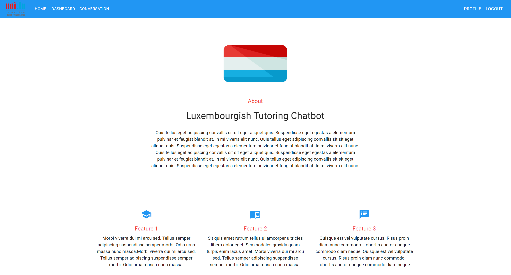
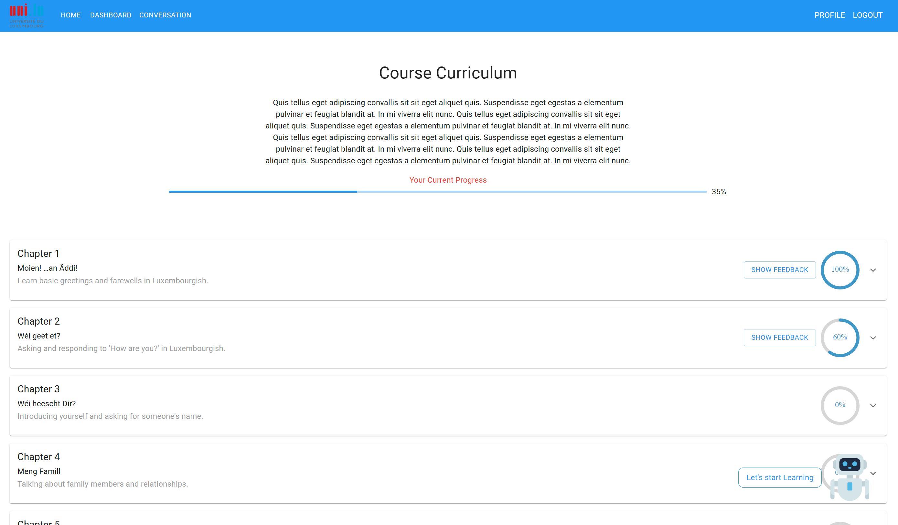
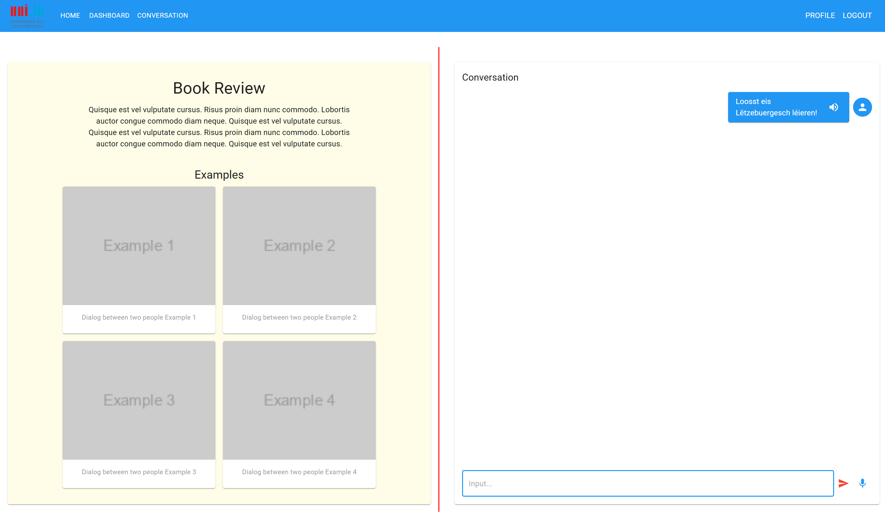

# Luxembourgish Language Learning Web Application (LLL) - Frontend

This repository contains the **frontend** for the Luxembourgish Language Learning (LLL) web application. The app helps users learn and practice the Luxembourgish language through interactive and engaging features, providing a smooth and modern user experience.

## Table of Contents
- [Overview](#overview)
- [Features](#features)
- [Technologies Used](#technologies-used)
- [Prerequisites](#prerequisites)
- [Installation*](#installation)
- [Running the Application*](#running-the-application)
- [Setup with Yarn](#Setup-with-Yarn)
- [Screenshots](#screenshots)
- [Future work](#Future-work)
- [Contact](#contact)

## Overview

All the credit from the [backend](https://github.com/parsavares/WebApplication-lux-chatbot/tree/main/Backend) goes to the following contributors:
-[Titouan Guerin](https://github.com/Titouaaaan)
-[Meryem Elfatimi](https://github.com/MeryMEF)
The backend originally comes from the [official ELL-MMA](https://github.com/Titouaaaan/ELL-MMA) repository.


The **Luxembourgish Language Learning** (LLL) web application is a React-based project that assists users in learning Luxembourgish through various language learning modules. The app offers interactive features and responsive design, making it suitable for use on multiple devices.

## Features

- **Interactive Language Learning Modules**: Choose from reading, conversation, and listening practices.
- **Responsive Design**: Fully optimized for mobile, tablet, and desktop devices.
- **User-Friendly Interface**: Simple and intuitive UI built with Material-UI.
- **Audio Features**: Record and send audio messages to practice pronunciation.
- **Backend Integration**: Communicates with backend APIs for fetching recommendations and AI-generated responses.

## Technologies Used

This project uses a variety of modern web technologies:

- **React**: A JavaScript library for building user interfaces.
- **Material-UI**: A component library for React that offers sleek and customizable UI components.
- **Axios**: A library for making HTTP requests.
- **MediaRecorder API**: For handling audio recording within the browser.
- **React Router**: For handling routing within the web application.
- **Emotion (CSS-in-JS)**: Used for applying styles to components.

## Prerequisites

Before you begin, ensure you have met the following requirements:
- **Node.js**: Version 14.x or higher.[LINK](https://nodejs.org/en)
- **npm**: The package manager for JavaScript.
- **Visual Studio Code**: A powerful code editor for developing the project.

## Installation

Follow these steps to set up the project locally:

1. **Clone the repository**:

    ```bash
    git clone https://github.com/parsavares/WebApplication-lux-chatbot.git
    ```

2. **Install the dependencies**:

    ```bash
    npm install
    ```


## Running the Application

1. **Open the project in Visual Studio Code**:

    ```bash
    code .
    ```

2. **Start the development server**:

    In the integrated terminal of Visual Studio Code, run the following command:

    ```bash
    npm start
    ```

3. **Access the app in your browser**:

    Once the development server is running, open your browser and go to [http://localhost:3000](http://localhost:3000) to see the app in action.


## Setup with Yarn

To install dependencies and run the project using Yarn, follow these steps:

1. **Install Yarn** (if not already installed):
   ```bash
   npm install -g yarn
   ```

2. **Install dependencies**:
   Navigate to the project directory and run:
   ```bash
   yarn install
   ```

3. **Start the application**:
   Run the application (replace `yarn start` with the actual start command for your project):
   ```bash
   yarn start
   ```

4. **Other useful Yarn commands**:
   - Build the project for production:
     ```bash
     yarn build
     ```
   - Run tests:
     ```bash
     yarn test
     ```

For more information on using Yarn, visit the [official Yarn documentation](https://yarnpkg.com/).


### Post-Installation Notes(Yarn)

1. **Mixed Lockfiles**:  
   Your project contains both `yarn.lock` and `package-lock.json`. Since you're using Yarn, it's recommended to stick with one package manager to avoid resolution inconsistencies. You can safely delete the `package-lock.json` file to prevent conflicts:
   ```bash
   rm package-lock.json
   ```

2. **Deprecated Packages**:  
   During installation, some packages showed warnings about being deprecated (e.g., `workbox-webpack-plugin`, `rimraf`). While they still function, it's a good idea to eventually replace or update them for long-term compatibility. Check the package documentation for alternatives.

3. **Unmet Peer Dependencies**:  
   Some packages have unmet peer dependencies, which were noted during the installation. These warnings do not break the build, but if you experience issues, you can install the missing peer dependencies manually. For example:
   ```bash
   yarn add typescript @babel/plugin-syntax-flow
   ```

4. **Running the Application**:  
   To start the application, run the following command:
   ```bash
   yarn start
   ```


## Screenshots

### Home Page


### Dashboard


### Conversation Page


## Future work

The following list of tasks that still need to be completed or improved:

- Connect the progress tracking functionality from the backend with the frontend
- Implement dynamic images
- Address prompt engineering issues in the backend (such as Markdown in messages, and User Response displayed by the chatbot)
- Fix the issue with the messages between the communicator and orchester agents being displayed as messages to the user
- Resolve prompt engineering issues between the tracker and tutor agent, as well as the tutor agent's content retrieval tool (an issue previously occurred with Meryem and Titouan; consider fine-tuning the tutor agent as Meryem already suggested)
- Implement database on the backend to replace the current localStorage used to persist history at the browser level.

## Contact

If you have any questions or need further assistance, please feel free to contact us:

- Othmane Mahfoud: [othmane.mahfoud.001@student.uni.lu](mailto:othmane.mahfoud.001@student.uni.lu)
- Parsa Vares: [parsa.vares@uni.lu](mailto:parsa.vares@uni.lu)
- Hedi Tebourbi: [hedi.tebourbi.001@student.uni.lu](mailto:hedi.tebourbi.001@student.uni.lu)

***

Thank you for using the Luxembourgish Language Learning web application!
